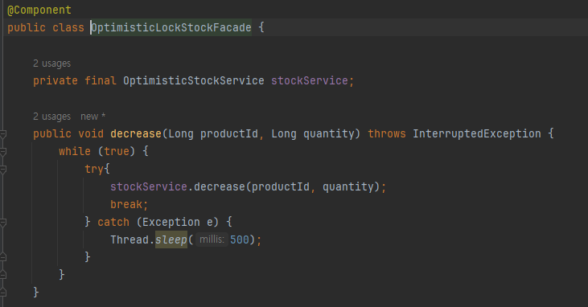
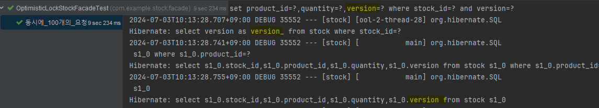

# 데이터 정합성 학습

### 1. <a href="https://github.com/gongseunghwa/spring_concurrency_issue">기본 프로젝트</a> 개요
재고 관리 시스템
- 프로젝트 구조

- 주요 기능

상품 ID와 수량을 받아 
1. 해당 상품 호출
2. quantity 만큼 상품의 재고 감소
3. 변경사항 저장

### 2. 정합성 검증 테스트

- 동시에 100개의 요청을 날리는 테스트

