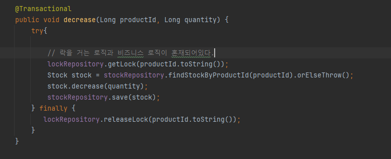
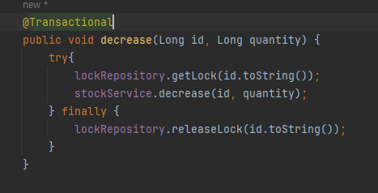
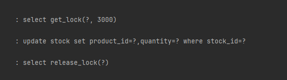

# 데이터 정합성 학습

### 1. <a href="https://github.com/gongseunghwa/spring_concurrency_issue">기본 프로젝트</a> 개요
재고 관리 시스템
- 프로젝트 구조 <br>

- 주요 기능

<br>
1. 해당 상품 호출
2. quantity 만큼 상품의 재고 감소
3. 변경사항 저장

### 2. 동시에 100개의 요청을 날리는 테스트(실패)


### 3. synchronized 활용(실패)



### 4. synchronized 활용(성공)
- 앞의 방법에서 @Transactional 어노테이션을 제거 >> 성공
<br>


<br>
- @Transactional 어노테이션을 붙였을 때 실패하는 이유 >> 
Transaction이 적용된 클래스는 CGLIB에 의해서 런타임에 해당 클래스 기반 프록시가 생성된다

```text
Begin Transaction => method => commit Transaction
```

<br>
- 위 구조로 기존 메소드를 감싸 실행 전,후로 새로운 코드를 호출한다. <br>
Begin Transaction 과 commit Transaction 은 synchronized 메소드가 아니므로 무결성을 보장받을 수 없다.
- 기존 트랜잭션 메소드가 완료되고 commit 되기까지의 사이 시간에 다른 스레드가 진입하게 되면 레이스 컨디션이 발생한다.

- synchronized 는 하나의 프로세스에서 동작하기 때문에 여러개의 서버 혹은 여러개의 프로그램에서 동작하는 경우 레이스 컨디션을 막을 수 없다.

### 4. Pessimistic Lock (비관적 락)을 활용 => 성공
- 모든 트랜잭션이 충돌이 발생한다 가정하고 우선 Lock을 거는 방법
- DB의 Lock 기능을 활용(주로 select for update 구문 사용)
- 비관적 락에는 데드락이 발생할 수 없는가? >> NO
순환참조와 같은 방식으로 데드락이 발생할 수 있다.
- 비관적락의 문제점
1. 성능 저하
비관적 락은 모든 트랜잭션에 대해 Lock을 적용하기 때문에 트래픽이 많은 경우에는 성능저하가 꽤 크다(O(N^2) 정도)
2. 여전히 데드락이 발생할 수 있다.


- Spring Data JPA는 @Lock을활용하여 쉽게 Lock을 걸 수 있다.
<table>
<tr>
<th>MODE</th> <th>TYPE</th> <th>DESCRIPTION</th>
</tr>
<tr>
    <td>비관적 락</td>
    <td>PESSIMISTIC_READ</td>
    <td>다른 트랜잭션에게 읽기만 허용한다. <br> Shared Lock을 활용하여 락을 거는데 해당 기능을 지원하지 않으면 PESSMISITC_WRITE와 동일하게 동작한다.</td>
</tr>
<tr>
    <td>비관적 락</td>
    <td>PESSIMISTIC_WRITE</td>
    <td>DB에서 제공하는 행 배타잠금(Row Exclusive Lock)을 이용해 잠금을 획득한다. 다른 트랜잭션에서 쓰지도 읽지도 못한다.</td>
</tr>
<tr>
    <td>비관적 락</td>
    <td>PESSIMISTIC_FORCE_INCREMENT</td>
    <td>DB에서 제공하는 행 배타잠금을 이용하여 잠금과 동시에 버전을 증가시킨다.</td>
</tr>
</table>


### 5. 낙관적 락을 활용

<table>
<tr>
<th>MODE</th> <th>TYPE</th> <th>DESCRIPTION</th>
</tr>
<tr>
    <td>낙관적 락</td>
    <td>OPTIMISTIC</td>
    <td>낙관적 락을 사용한다.(트랜잭션 전후로 버전확인)</td>
</tr>
<tr>
    <td>낙관적 락</td>
    <td>OPTIMISTIC_FORCE_INCREMENT</td>
    <td>낙관적 락을 사용하면서 추가로 버전을 강제 증가시킨다. </td>
</tr>
</table>