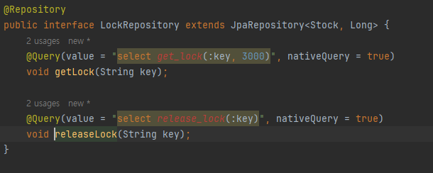
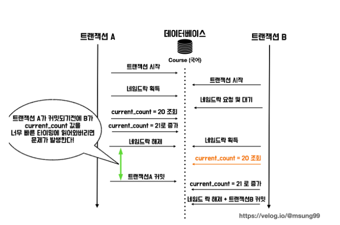

# 데이터 정합성 학습

### 1. <a href="https://github.com/gongseunghwa/spring_concurrency_issue">기본 프로젝트</a> 개요
재고 관리 시스템
- 프로젝트 구조

- 주요 기능

상품 ID와 수량을 받아 
1. 해당 상품 호출
2. quantity 만큼 상품의 재고 감소
3. 변경사항 저장

### 2. 동시에 100개의 요청을 날리는 테스트(실패)



### 3. synchronized 활용(실패)


### 4. synchronized 활용(성공)
- 앞의 방법에서 @Transactional 어노테이션을 제거 >> 성공



- @Transactional 어노테이션을 붙였을 때 실패하는 이유
Transactional 어노테이션을 사용하게 되면 AOP를 활용하여 새로운 프록시를 생성한다.
```text
Begin Transaction => method => commit Transaction
```
위 구조로 기존 메소드를 감싸 실행 전,후로 새로운 코드를 호출한다.
